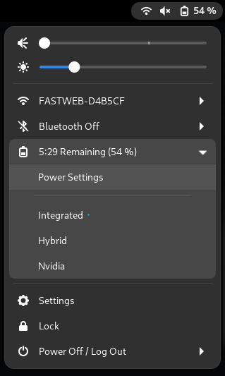

# GPU profile selector Gnome-Shell-Extension

## Description
A simple gnome shell extension which provides a simple way to switch between GPU profiles on Nvidia Optimus systems (i.e laptops with Intel + Nvidia or AMD + Nvidia configurations) in a few clicks.
In particular this extension is a graphic interface for [envycontrol](https://github.com/geminis3/envycontrol) program.




## Dependencies
- [bash](https://www.gnu.org/software/bash/)
- [pkexec command](https://command-not-found.com/pkexec)
- [envycontrol](https://github.com/geminis3/envycontrol) (make sure to have EnvyControl installed globally!)


## Installation

### Gnome-shell Extension website
- Install all the [dependencies](#Dependencies)
- Enable extension in official [Gnome Extension](https://extensions.gnome.org/extension/5009/gpu-profile-selector/) store

### AUR (not personally tested)
- AUR link: [https://aur.archlinux.org/packages/gnome-shell-extension-gpu-profile-selector-git](https://aur.archlinux.org/packages/gnome-shell-extension-gpu-profile-selector-git)

### Manual
- Install all the [dependencies](#Dependencies)
- Clone this repo with:
  - If you are using Gnome 43 or above:
  ```
  git clone https://github.com/LorenzoMorelli/GPU_profile_selector.git ~/.local/share/gnome-shell/extensions/GPU_profile_selector@lorenzo9904.gmail.com
  ```
  - Else (Gnome 42 or below):
  ```
  git clone --depth 1 --branch gnome-42-or-below https://github.com/LorenzoMorelli/GPU_profile_selector.git ~/.local/share/gnome-shell/extensions/GPU_profile_selector@lorenzo9904.gmail.com
  ```

## Debuging and packaging

### For looking command line logs
```
journalctl -f -o cat /usr/bin/gnome-shell
```

### For looking updates using wayland (it opens a new wayland session in a window)
```
dbus-run-session -- gnome-shell --nested --wayland
```

### Packaging the extension source for gnome extension website
```
gnome-extensions pack GPU_profile_selector@lorenzo9904.gmail.com \
--extra-source="README.md" \
--extra-source="prefs.xml" \
--extra-source="LICENSE" \
--extra-source="img" \
--extra-source="ui" \
--extra-source="lib"
```

## TODO
- In "AttachedToBatteryView" change the title by getting it directly from envycontrol.
- Add a setting for allowing user to choose where to place the extension view between topbar and menu panel.
- Change the big V close the gpu profile with icon
